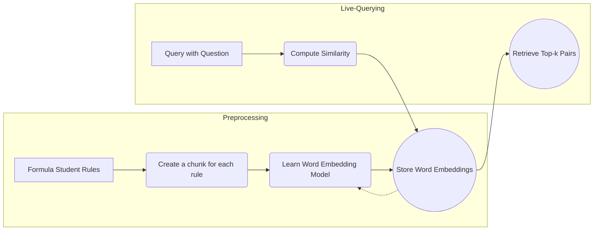
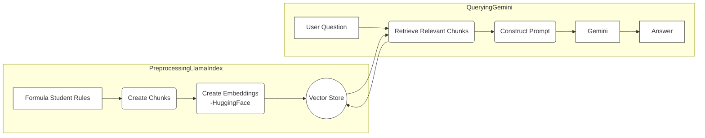
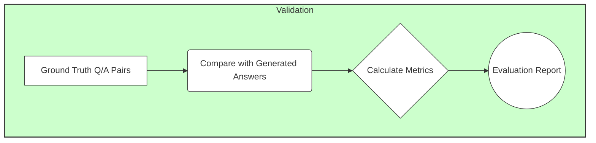

# Natural Language Processing with Word Embeddings, LLMs and RAG  

This repository implements a simple but realistic RAG pipeline with Large-Language-Models (LLMs) and experiments regarding answer generation given a question and a context. In the example, the "Formula Student Rules" are used but could be replaced by any other corpus (set of documents) or rule-set. 

Why is this an interesting problem? In order for teams to be able to compete in the Formula Student competition, one must be able to understand the rules. The rules are written in a very specific language and are often difficult to understand. By using such techniques, one could generate answers to questions about the rules, which would make it easier for teams to understand the rules. Additionally, teams have to successfully pass quizzes about the rules in order to qualify for the competition.

## How is this project related to real-world applications?
- **Legal Documents:** For example, in the legal domain, one could use a LLM to generate answers given a question and a legal document. This could be used to automate legal research or to help lawyers find relevant information in legal documents.
- **Input Management:** In the context of input management, one could use a LLM to generate answers given a question and a set of documents. This could be used to automate the processing of incoming emails or to help customer support agents find relevant information in a knowledge base.
- **Medical Records:** In the medical domain, one could use a LLM to generate answers given a question and a patient's medical record. This could be used to automate the processing of medical records or to help doctors find relevant information in a patient's medical record.
- **Technical Documentation:** In the technical domain, one could use a LLM to generate answers given a question and a set of technical documents. This could be used to automate the processing of technical documentation or to help engineers find relevant information in technical documents.

## Formula Student Rules

The basics of the Formula Student Rules are as follows:
- The Formula Student Rules are a set of rules that are used in the Formula Student competition.
- The rules are divided into different sections, such as "Chassis", "Powertrain", "Suspension", etc.
- Each section contains a set of rules that are related to the section.
- Each rule has a unique identifier, a title, and a description.

An example of a rule is:
```markdown
# EV 7 CHARGERS

## EV 7.1 Chargers General Requirements

| EV 7.1.1 | Only chargers presented and sealed at technical inspection are allowed. All connections must be insulated and covered. No open connections are allowed. |
| EV 7.1.2 | Exposed conductive parts and the TSAC must be connected to protective earth (PE). |
| EV 7.1.3 | All components interfacing with mains must be accredited to a recognized standard e.g. CE. All remaining parts must comply with all electrical requirements for the vehicle TS. |
```

## Embeddings & Embedding Models

The notebook [WordEmbeddingSimilarities.ipynb](WordEmbeddingSimilarities.ipynb) contains code to calculate similarities between words using different embedding models. It first creates a chunk for each rule from the Formula Student Rules and then trains the embeddings. 

How it would look like as a pipeline:

### Example Query and Results
Examples show that the model is able to find suitable rules for a given question, especially when the question contains keywords that are also present in the rules:


```markdown
# Query
What are the requirements for the emergency break system regarding opening of the SDC and start of deceleration?

# OUTPUT: Similar rules

T14.9.1 The Emergency Brake System (EBS) is considered to be “activated”, if the power supply
path defined in T15.2.2 is cut after passing the initial checkup sequence (T15.3.1). Brakes
may only be released after performing manual steps. 

T11.4.2 Each shutdown button must be a push-pull or push-rotate mechanical emergency switch
where pushing the button opens the SDC, see EV6.1 and CV4.1. 

T15.3.4 The safe state is the vehicle at a standstill, brakes engaged to prevent the vehicle from rolling,
and an open SDC. 


```


### Limitations of embeddings:
- **Understanding:** They are not able to capture the meaning of a word or sentence in a human-like way.
- **Complexity of documents & chunks:** For this use-case, where the document chunks or Question/Answer pairs are relatively small, embeddings may retrieve rules are not directly related to the question. This is because some words may be very similar or occur often in the corpus. However, for larger documents, this problem is less likely to occur because there are more words and the embeddings are more likely to capture the meaning of the document. Also, larger documents may differ more in their content, which makes it easier for the embeddings to distinguish between them.

### Advantages of embeddings:
- **Speed & Memory:** They are very fast to compute because they are pre-trained and stored in memory.
- **Interpretability & User's attention:** This method retrieves only a top-k amount of similar rules, which can be shown to the user. First, this is more interpretable than a black-box model. Second, the user can focus on the most relevant rules and ignore the rest. Therefore, there is no "blind trust" or "black-box" problem.


## Retrieval Augmented Generation (RAG) & Large-Language-Models (LLMs)
Since the embeddings are not able to understand the meaning of a word or sentence, we can use a LLM to generate answers. The LLM can generate answers given a question and a context. The context can be the whole document or a chunk of it. The LLM can be fine-tuned on the Formula Student Rules or any other corpus.

Notebook [RAG_pipeline.ipynb](RAG_pipeline.ipynb) implements a simple RAG pipeline using two pre-trained models:

- a model trained for question/answering (Q/A) tasks ([RoBERTa](https://huggingface.co/deepset/roberta-base-squad2))
- a model trained for text generation ([Mistral-Nemo]((https://huggingface.co/mistralai/Mistral-Nemo-Instruct-2407)))

 How a basic RAG pipeline would look like:


### Example Query and Results

How would you validate the LLM? One could either do a qualitative or quantitative evaluation. For a qualitative evaluation, one would look at the generated answers and see if they make sense. For a quantitative evaluation, one would use a ground-truth dataset with queries and answers and compare the generated answers with the ground-truth answers. Because this is a very task-specific evaluation, one would need to create a dataset with queries and answers that are specific to the Formula Student Rules.



## Fine-Tuning a LLM on Formula Student Rules
As in real-world problems that organizations face, the Formula Student Rules are a set of documents that are specific to a certain domain. In this case, the domain is the Formula Student competition. Additionally to implementing a RAG, there are multiple ways to improve the performance of a LLM on a specific domain:

- **Pre-Prompts:** One could use pre-prompts to give the model some context about the domain. For example, one could give the model some examples of questions and answers from the Formula Student Rules.
- **Fine-Tuning:** One could fine-tune the model on the Formula Student Rules. This would allow the model to learn the specific language and terminology of the Formula Student competition.
- **Prompt Engineering/Optimization:** One could optimize the prompt that is given to the model. This could involve changing the structure of the prompt, adding more context to the prompt, or using different prompts for different types of questions.
