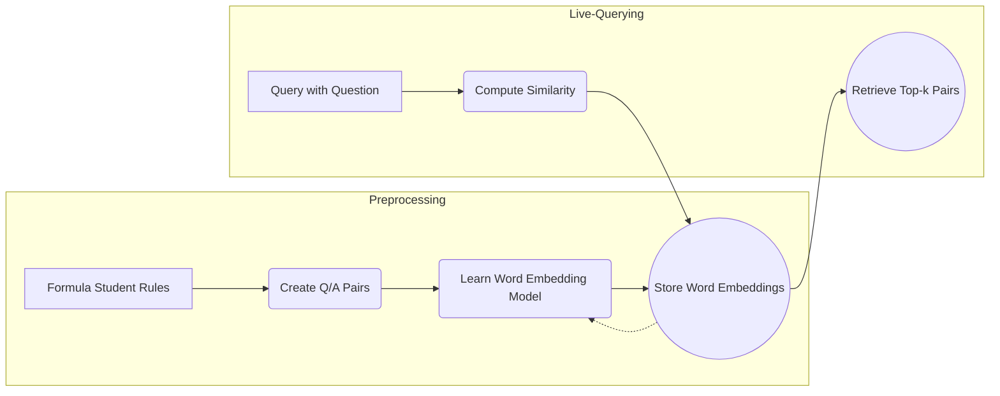

# LLM_RAG

This repository implements a simple but realistic RAG pipeline with Large-Language-Models (LLMs) and experiments regarding answer generation given a question and a context. In the example, the "Formula Student Rules" are used but could be replaced by any other corpus (set of documents) or rule-set.

## Embeddings & Embedding Models

The notebook `WordEmbeddingSimilarities.ipynb` contains code to calculate similarities between words using different embedding models. It first creates Question-Answer pairs from the Formula Student Rules and then trains the embeddings. 

How it would look like as a pipeline:

### Limitations of embeddings:
- **Understanding:** They are not able to capture the meaning of a word or sentence in a human-like way.
- **Complexity of documents & chunks:** For this use-case, where the document chunks or Question/Answer pairs are relatively small, embeddings may retrieve rules are not directly related to the question. This is because some words may be very similar or occur often in the corpus. However, for larger documents, this problem is less likely to occur because there are more words and the embeddings are more likely to capture the meaning of the document. Also, larger documents may differ more in their content, which makes it easier for the embeddings to distinguish between them.

### Advantages of embeddings:
- **Speed & Memory:** They are very fast to compute because they are pre-trained and stored in memory.
- **Interpretability & User's attention:** This method retrieves only a top-k amount of similar rules, which can be shown to the user. First, this is more interpretable than a black-box model. Second, the user can focus on the most relevant rules and ignore the rest. Therefore, there is no "blind trust" or "black-box" problem.

